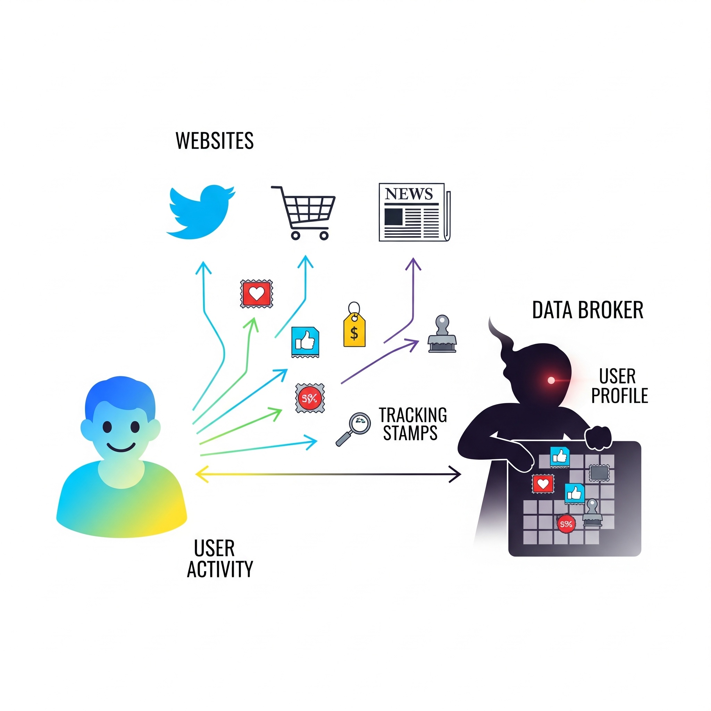
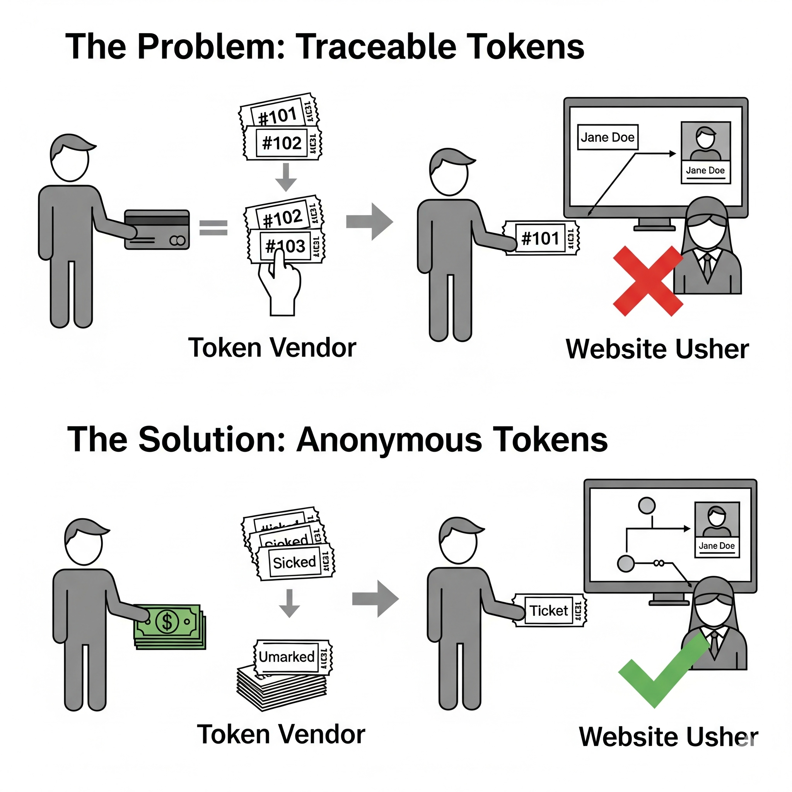
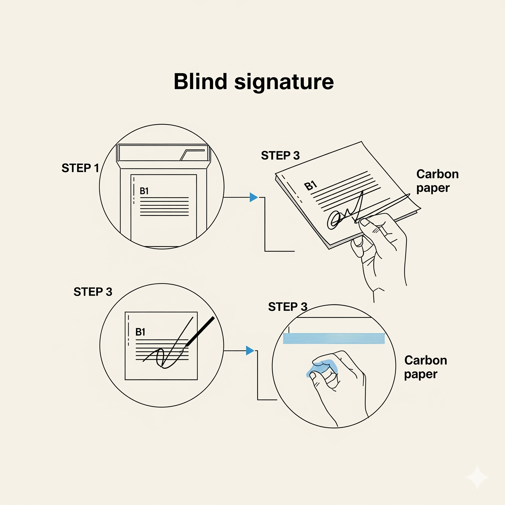
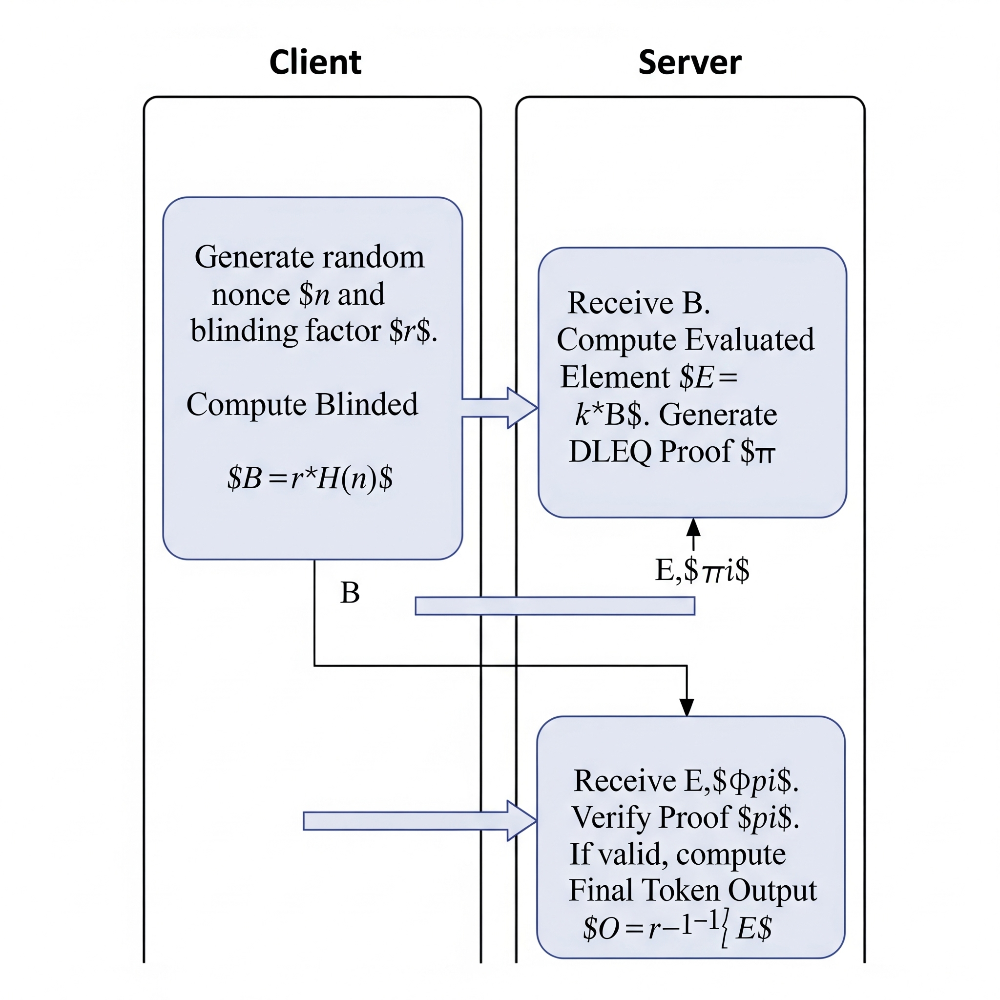
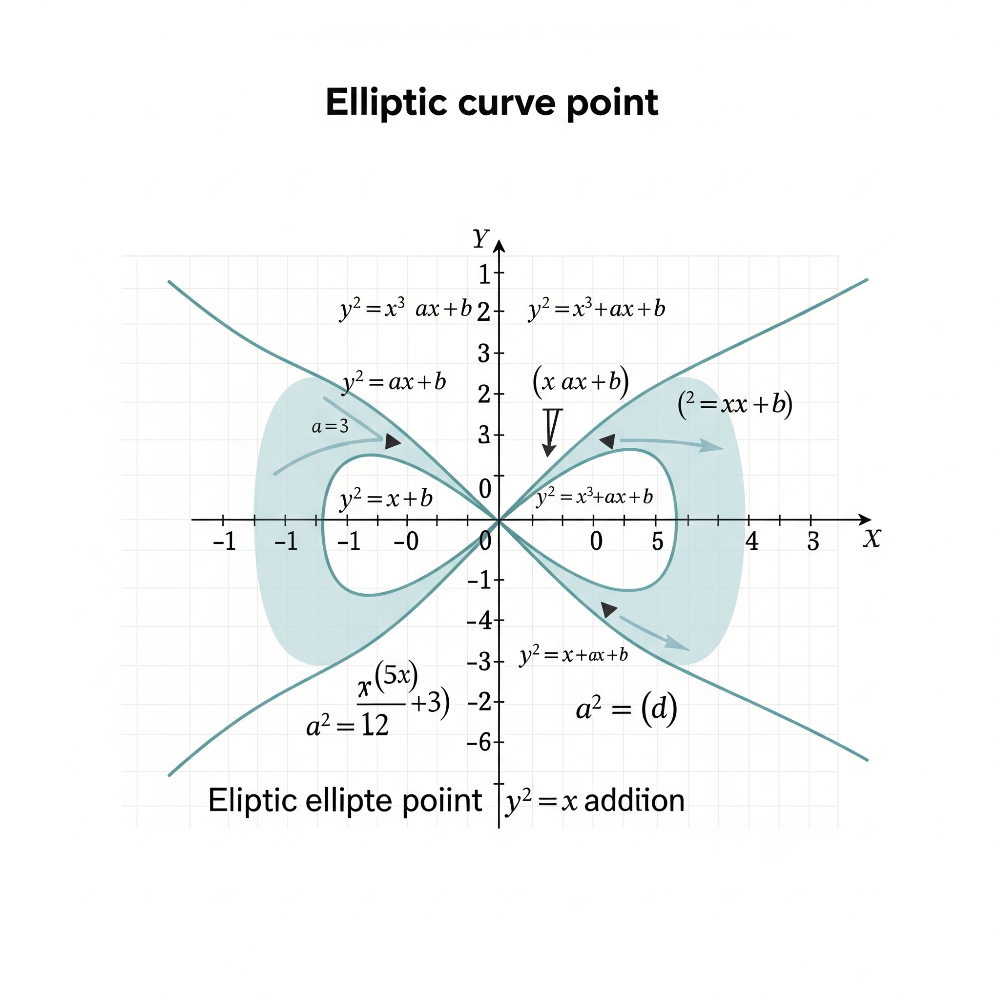

# Privacy Pass Interactive Demo

An interactive educational demonstration of the Privacy Pass protocol using Verifiable Oblivious Pseudorandom Functions (VOPRFs). This demo explains how privacy-preserving tokens work through hands-on examples and visual analogies.

## 🎯 What is Privacy Pass?

Privacy Pass is a cryptographic protocol that allows users to prove they're legitimate without revealing their identity. Think of it as anonymous admission tickets that can't be traced back to you.

### The Problem: Online Tracking



Every website visit leaves digital "stamps" that data brokers use to build detailed profiles. This tracking undermines user privacy and creates comprehensive surveillance.

### The Solution: Anonymous Tokens



Privacy Pass provides anonymous tokens that prove legitimacy without traceability. Like paying cash for generic tickets versus using a trackable credit card for numbered seats.

## 🔐 How It Works

### The Carbon Paper Analogy



Privacy Pass uses "blind signatures" - like having someone sign a sealed envelope containing your secret message. The signature goes through carbon paper, marking your document without the signer seeing its contents.

### Zero-Knowledge Proofs


Zero-knowledge proofs let you prove you know something without revealing what you know. Like proving you found Wally by showing only him through a small window, without revealing his location on the page.

## 🛠 Technical Implementation

### VOPRF Protocol Flow



The Verifiable Oblivious Pseudorandom Function (VOPRF) protocol ensures:
- **Oblivious**: Server can't see what it's signing
- **Pseudorandom**: Outputs look random but are deterministic
- **Verifiable**: Client can verify the signature is correct

### Elliptic Curve Cryptography



Built on elliptic curve mathematics where point addition creates a "billiards-like" path on the curve. This provides the mathematical foundation for secure, efficient cryptographic operations.

## 🚀 Try the Demo

### Live Demo
Visit the interactive demo to experience Privacy Pass step-by-step:
- Understand the privacy problem
- Learn cryptographic concepts through analogies  
- Generate your own privacy-preserving tokens
- See the complete protocol in action

### Local Development

```bash
# Clone the repository
git clone https://github.com/your-username/privacypassdemo.git
cd privacypassdemo

# Install dependencies
npm install

# Start development server
npm run dev

# Build for production
npm run build

# Start production server
npm run start:server
```

## 🏗 Architecture

- **Frontend**: React + Vite for interactive educational interface
- **Backend**: Express.js server implementing VOPRF protocol
- **Crypto**: @noble libraries for elliptic curve operations
- **Deployment**: Docker containers with CI/CD via GitHub Actions

### Project Structure
```
├── src/
│   ├── components/steps/     # Interactive demo steps
│   └── lib/crypto.js        # Cryptographic utilities
├── server/
│   ├── index.js            # Express API server
│   └── crypto.js           # Server-side crypto operations
├── images/                 # Educational diagrams
└── design/                 # Image generation prompts
```

## 🌟 Educational Goals

This demo teaches:
- **Privacy fundamentals**: Why online privacy matters
- **Cryptographic concepts**: Blind signatures, zero-knowledge proofs
- **Protocol mechanics**: How VOPRF works step-by-step
- **Real-world applications**: Where Privacy Pass is used today

## 🛡 Security Notes

This is an educational demo. For production use:
- Use proper random number generation
- Implement robust error handling
- Add rate limiting and DoS protection
- Use production-grade cryptographic libraries
- Follow security best practices for key management

## 📚 Learn More

- [Privacy Pass IETF Draft](https://datatracker.ietf.org/doc/draft-ietf-privacypass-architecture/)
- [VOPRF RFC 9497](https://datatracker.ietf.org/doc/rfc9497/)
- [Elliptic Curve Cryptography](https://blog.cloudflare.com/a-relatively-easy-to-understand-primer-on-elliptic-curve-cryptography/)
- [Zero-Knowledge Proofs Explained](https://blog.cloudflare.com/zero-knowledge-proofs-explained/)

## 🤝 Contributing

Contributions welcome! This demo aims to make cryptographic concepts accessible to everyone. Please:
- Keep explanations simple and clear
- Add visual aids where helpful
- Test educational effectiveness
- Follow existing code patterns

## 📄 License

MIT License - See [LICENSE](LICENSE) file for details.

---

*Making cryptography accessible through interactive education* 🎓✨
